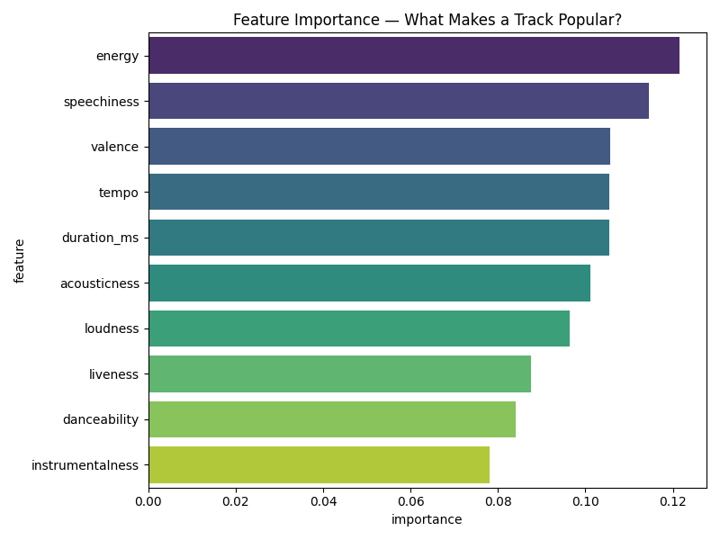

---

##  Feature Importance Visualization

The model reveals which audio features have the strongest influence on whether a track becomes popular.  
Below is the feature importance plot generated by the Random Forest classifier:

<p align="center">
  
</p>

###  Key Insights
- Tracks with **higher energy and danceability** are more likely to be popular.
- **Loudness** and **tempo** also show strong influence.
- More subtle features, like **acousticness** and **instrumentalness**, play a smaller role.

This visualization helps explain *why* the model makes certain predictions and gives insight into the characteristics of hit songs.

---
#  Spotify Track Popularity Prediction

**Predictive modeling for Spotify house-music tracks** — using audio features, track metadata and popularity data to build a machine learning model that classifies whether a track will be “popular.”  

##  What this project does

- Loads cleaned data for ~1000 house / electronic-house tracks.  
- Creates a binary target *popular vs not popular* based on 70th percentile popularity.  
- Uses key audio & track features (danceability, energy, loudness, tempo, etc.) to train a model.  
- Builds a :contentReference[oaicite:0]{index=0} model, evaluates accuracy, and reports performance.  
- Outputs a feature-importance plot, highlighting which song attributes most influence popularity.  
- Saves the trained model to enable future predictions on new songs.  

##  Project Structure

Spotify-Popularity-ML/
│
├── analysis/
│ ├── ml_model.py # Core script: data loading → model training → evaluation → save
│
├── data/
│ └── spotify_house_music.csv # Input dataset of house-music tracks
│
├── models/
│ └── spotify_popularity_model.pkl # Serialized trained model
│
├── outputs/
│ └── feature_importance.png # Visualization of feature importances
│
├── README.md
└── requirements.txt

##  How to Run

```bash
pip3 install -r requirements.txt
python3 analysis/ml_model.py

